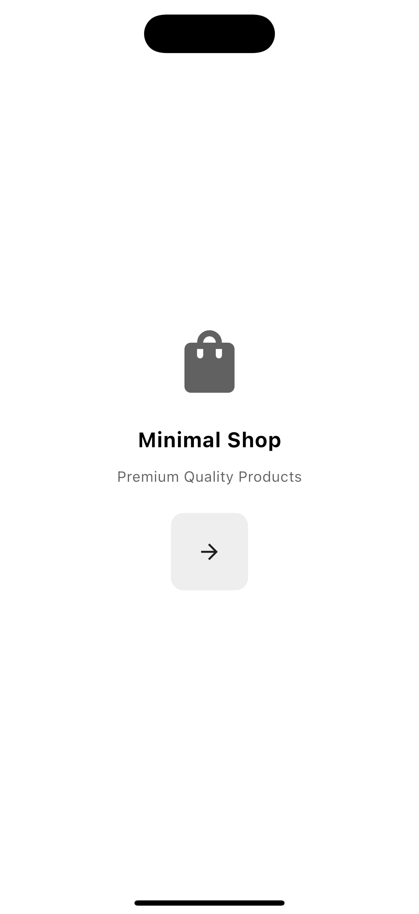
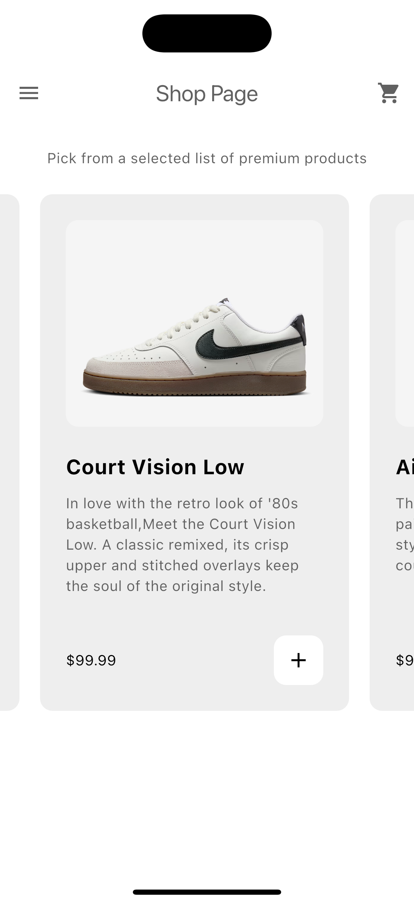

# 🛍️ EcommerceApp

A Flutter-powered cross-platform e-commerce demo application with a clean UI, product browsing, cart management, and profile screen.  
Built as a showcase project for learning Flutter app architecture, state management, and multi-platform support.

---

## ✨ Features

- 📱 **Cross-platform support**: Runs on Android, iOS, Web, Windows, macOS, and Linux.  
- 🛒 **Product browsing**: View a catalog of shoes, watches, and accessories with images.  
- ➕ **Cart management**: Add/remove products from the cart and view total items.  
- 👤 **Profile page**: Placeholder profile page for user info.  
- 🎨 **Custom UI components**: Buttons, drawer navigation, product tiles, and list tiles.  
- 🌗 **Light mode theme** (extendable to dark mode).  
- 🚀 **Scalable structure** with `models/`, `components/`, and `pages/` for easy feature growth.

---

## 📸 Screenshots

*(Add real app screenshots here — e.g., Intro Page, Shop Page, Cart Page, Profile Page)*  

| Intro Page | Shop Page | Cart Page | Profile Page |
|------------|-----------|-----------|--------------|
|  |  |  |  |

---

## 🛠️ Getting Started

### Prerequisites
- [Flutter SDK](https://flutter.dev) (latest stable)  
- Android Studio / VS Code / Xcode (for mobile builds)  
- A connected device or emulator

### Setup
```bash
# Clone the repository
git clone https://github.com/Saquib504/EcommerceApp.git

# Navigate into the project
cd EcommerceApp

# Install dependencies
flutter pub get

# Run on your device (default)
flutter run

# Run on specific platform
flutter run -d chrome     # Web
flutter run -d macos      # macOS
flutter run -d windows    # Windows
